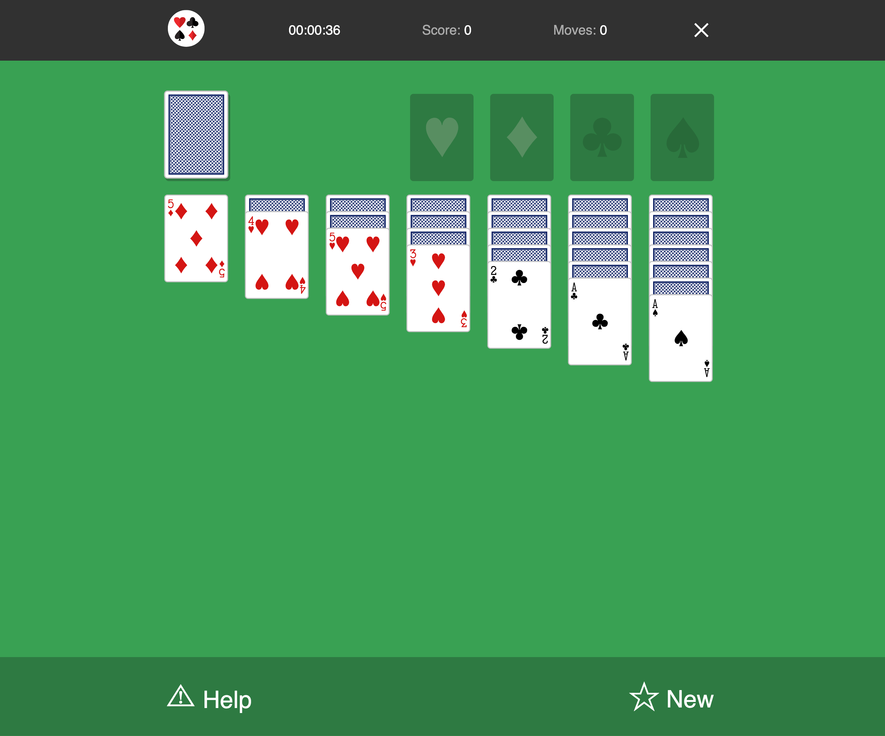

# Solitaire Card Game (Cheat Version)

This is a simple implementation of the classic solitaire card game using HTML, CSS, and JavaScript. In this game, your goal is to move all the cards to the foundation piles ~~following the traditional solitaire rules~~.

### Front-end technologies

- HTML
- CSS
- Vanilla JavaScript

## Features

- Drag-and-drop card movement.
- Foundation piles to stack cards from Ace to King in each suit.
- Tableau piles to arrange cards in descending order and alternate colors.
- Stock pile and waste pile for drawing and discarding cards.
- Score tracking.
- Move count tracking.
- Timer to keep track of your playtime.
- Winning condition when all cards are stacked in the foundation piles.

## How to Play

1. **Goal**: Move all cards to the foundation piles, ~~starting with Ace and ending with King for each suit~~.

2. **Tableau Piles**: Arrange cards in descending order and alternate colors. ~~You can move a sequence of cards if they are in descending order and have alternating colors~~.

3. **Foundation Piles**: Stack cards ~~from Ace to King~~ in each suit.

4. **Stock and Waste Piles**: Click on the stock pile to draw a card to the waste pile. Click on the waste pile to move cards to the tableau or foundation piles.

5. **Scoring**: Gain points for each move - 2 points for correct moves within tableau pils and 4 points for correct moves to foundation piles.

6. **Timer**: Track your playtime as you enjoy the game.

7. **Winning**: You win when all cards are successfully moved to the foundation piles.

## How to Play

Visit this link to enjoy free online gameplay:

https://samuelurom.github.io/solitaire/
